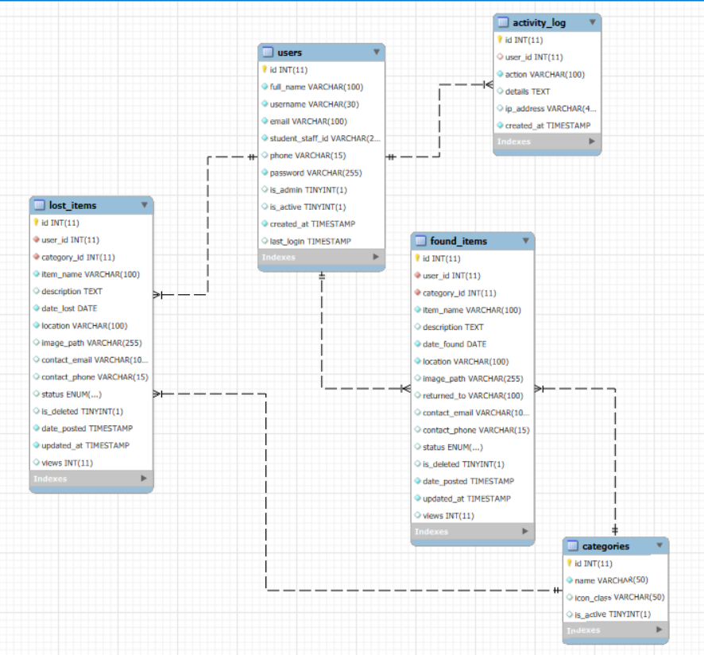

# ISU Lost & Found Website

## Overview

The ISU Lost & Found website is a web application designed to help members of Isabela State University report and find lost or found items. This is a refreshed version of the 2017 Cal Poly Pomona Lost & Found thesis, rebuilt with modern UI/UX and powered by PHP and MySQL.

The application allows users to:

- Register and log in to their accounts
- Post lost or found items with details and images
- Browse listings with filters for categories, keywords, and status
- View recent lost and found items on the homepage
- Recover passwords if forgotten

Administrators can manage the system through an admin panel, including:

- Reviewing and approving item postings
- Managing categories
- Viewing statistics and activity logs

## Features

### User Features

- **Homepage**: Displays statistics, recent items, and how the system works
- **Listings Page**: Tabbed view of lost and found items with search and filter options
- **Dashboard**: Personal dashboard for posting new items and managing existing ones
- **Authentication**: Secure registration, login, and password recovery
- **Responsive Design**: Works on desktop and mobile devices

### Admin Features

- **Admin Dashboard**: Overview of system statistics
- **Queue Management**: Review and approve pending item postings
- **Category Management**: Add, edit, or remove item categories
- **Activity Logs**: Monitor user activities
- **Statistics**: View detailed reports on lost and found items

## Technologies Used

- **Backend**: PHP 7+
- **Database**: MySQL
- **Frontend**: HTML5, CSS3, JavaScript
- **Server**: Apache (via XAMPP)
- **Styling**: Custom CSS with responsive design

## Installation and Setup

### Prerequisites

- XAMPP (or similar Apache/MySQL/PHP stack)
- Web browser

### Steps

1. **Install XAMPP**:

   - Download and install XAMPP from [apachefriends.org](https://www.apachefriends.org/)
   - Ensure Apache and MySQL modules are installed
2. **Clone or Download the Project**:

   - Place the `Lost_And_Found` folder in your XAMPP `htdocs` directory (e.g., `C:\xampp\htdocs\` on Windows)
3. **Set Up the Database**:

   - Start XAMPP Control Panel and start Apache and MySQL
   - Open phpMyAdmin (http://localhost/phpmyadmin)
   - Create a new database (e.g., isu_lost_found)
   - Import the `sql/isu_lost_found.sql` file into the database
4. **Configure Database Connection**:

   - Edit `includes/config.php` to set your MySQL credentials:
     ```php
     define('DB_HOST', 'localhost');
     define('DB_USER', 'root');
     define('DB_PASS', '');
     define('DB_NAME', 'isu_lost_found');
     ```
5. **Start the Application**:

   - Ensure Apache and MySQL are running in XAMPP
   - Open your browser and go to: `http://localhost/Lost_And_Found/index.php`

## Usage

### For Users

1. **Register**: Visit the registration page to create an account
2. **Login**: Use your credentials to log in
3. **Browse Items**: Use the listings page to search for lost or found items
4. **Post Items**: From the dashboard, submit details about lost or found items, including images
5. **Manage Posts**: Edit or delete your own postings from the dashboard

### For Administrators

1. **Access Admin Panel**: Log in with admin credentials and navigate to `/admin/`
2. **Manage Queue**: Review pending item postings in the queue
3. **Categories**: Add or modify item categories
4. **View Stats**: Check system statistics and activity logs

## Documentation

This project includes:

- A clear overview of features for users and admins
- Setup and installation instructions using XAMPP
- An ERD image illustrating database relationships
- A normalized SQL schema in `sql/isu_lost_found.sql`

## Database Design Overview

The system uses a normalized MySQL database with 5 main tables:

- **users**: Stores user accounts with authentication details (username, email, admin status)
- **categories**: Predefined item categories for classification (Electronics, Books, etc.)
- **lost_items**: Items reported as lost by users (with status: active/claimed)
- **found_items**: Items reported as found by users (with status: active/claimed)
- **activity_log**: Audit trail for admin monitoring (user actions, timestamps, IP addresses)

### Relationships:
- Users can report multiple lost and found items (1:N relationship)
- Items belong to categories (N:1 relationship)
- Users perform activities logged in activity_log (1:N relationship, nullable for anonymous actions)

### Key Features:
- Foreign key constraints with CASCADE deletes and SET NULL for data integrity
- Proper indexing on frequently queried fields for performance
- Enum status fields for tracking item lifecycle states
- Comprehensive activity logging for security and moderation

See the ERD diagram below and complete schema in `sql/isu_lost_found.sql`.

## Entity Relationship Diagram



## File Structure

```
Lost_And_Found/
├── index.php              # Homepage
├── listings.php           # Item listings page
├── dashboard.php          # User dashboard
├── login.php              # Login page
├── register.php           # Registration page
├── recover_password.php   # Password recovery
├── logout.php             # Logout script
├── admin/                 # Admin panel
│   ├── index.php          # Admin dashboard
│   ├── queue.php          # Pending items queue
│   ├── categories.php     # Category management
│   ├── activity.php       # Activity logs
│   └── stats.php          # Statistics
├── assets/                # Static assets
│   ├── css/               # Stylesheets
│   ├── js/                # JavaScript files
│   └── images/            # Images
├── includes/              # PHP includes
│   ├── config.php         # Database configuration
│   ├── db.php             # Database connection
│   ├── functions.php      # Utility functions
│   ├── header.php         # HTML header
│   └── footer.php         # HTML footer
├── sql/                   # Database schema
│   └── isu_lost_found.sql       # SQL dump
└── README.md              # This file
```
